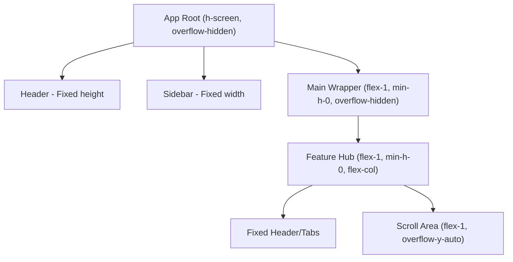

# CELAEST Layout System Guide

This guide defines the architectural and UX principles for the **CELAEST Dashboard** layout. Consistency in spacing and scrolling behavior is critical to maintaining a premium, enterprise-grade software feel.

## 1. The "Zero Global Scroll" Principle (Static Layout)

In a high-productivity dashboard, the user must never lose their primary navigation context. CELAEST enforces a **rigid, static viewport layout** where the main application window never scrolls.

### 🛠️ Technical Implementation Spec

To achieve a static layout without cutting off content, you must implement a **Flex-Height Chain**:

1.  **Level 0: Viewport Lock**
    - Root `AppContent.tsx` must be `h-screen w-screen overflow-hidden`.
2.  **Level 1: Propagation Chain**
    - Every parent container between the Root and the Scroll Area must be:
      - `flex flex-col` (to fill height vertically)
      - `min-h-0` (CRITICAL: Allows the container to shrink smaller than its children's natural height)
      - `flex-1` (to take up remaining space)
3.  **Level 2: The Trap**
    - The actual content container must be `overflow-y-auto` (or `overflow-y-scroll`).
    - This "traps" the scrollbar inside the specific card or table.

### 📐 Structural Diagram

---

## 2. Side Padding Standardization (16px)

To achieve perfect vertical symmetry across all modules, CELAEST uses a **global 16px (1rem) padding baseline**.

### 🛠️ Implementation Specs

- **Main Wrapper:** The `<main>` tag in `AppContent.tsx` must use `p-4` (padding: 1rem).
- **Header Alignment:** The `Header.tsx` container must use `px-4`.
- **Feature Modules:** Individual features should **not** define horizontal padding at their root level to avoid padding stacking. They must rely on the `AppContent` p-4.

---

## 3. Premium Card Styles (The "Billing" Standard)

For high-end data visualization, use the following "Premium Card" pattern inspired by the Billing module.

### 🛠️ Visual Spec

- **Container:** `rounded-2xl border transition-all duration-300 hover:scale-[1.02]`
- **Dark Mode:** `bg-black/40 backdrop-blur-xl border-white/10 hover:border-white/20 hover:shadow-[0_0_30px_rgba(255,255,255,0.05)]`
- **Light Mode:** `bg-white border-gray-200 shadow-sm hover:shadow-xl`

### 🏗️ Content Architecture

1.  **Icon Box:** `w-12 h-12 rounded-xl flex items-center justify-center bg-color-500/10 text-color-400`.
2.  **Label:** `text-xs font-bold uppercase tracking-widest text-gray-500/400`.
3.  **Value:** `text-3xl font-black tracking-tighter`.
4.  **Trend/Meta:** `text-sm font-bold` with color-coded success/error states.

---

## 4. Bento Grid Layouts

Avoid linear lists of widgets. Use CSS Grids to create a hierarchy of information.

- **Primary Hero:** Use `lg:col-span-2` for charts or critical live data.
- **Side Metrics:** Use `lg:col-span-1` for snapshot metrics.
- **Responsive Breaks:** `grid-cols-1 md:grid-cols-2 lg:grid-cols-3/4`.

---

## 5. The "Command Center" Rhythm

Proper vertical spacing ensures data remains legible and actions are clearly separated.

- **Header Spacing:** Use `mb-10` or `py-6` for headers to allow breathing room for titles.
- **Bottom Buffer:** All scrollable containers **must** include a `pb-16` or `pb-20` (padding-bottom: 64px-80px).
  - **Reason:** This prevents the last row of data from feeling "trapped" or colliding with the bottom of the viewport. It also leaves space for floating elements or tooltips.

---

## 4. Scalability Logic

If you are creating a new feature module:

1.  **Do not use `px-` at the top level.** Let the parent layout handle it.
2.  **Use `flex-1 overflow-hidden flex-col`** for the module's main wrapper.
3.  **Wrap your list/table in a `flex-1 overflow-auto` container.**
4.  **Add `pb-16`** to your internal scrollable list.

---

_Follow these rules to ensure the CELAEST Dashboard continues to feel like a high-end, native-performing command center._
